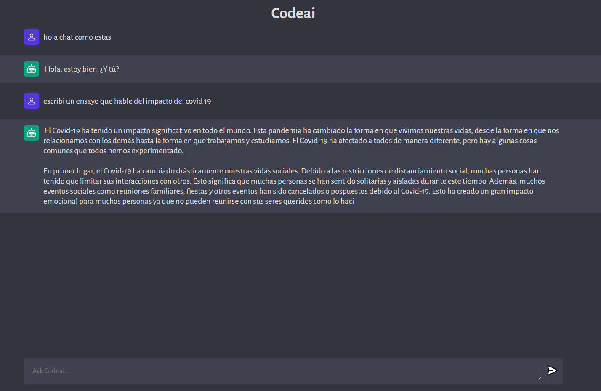
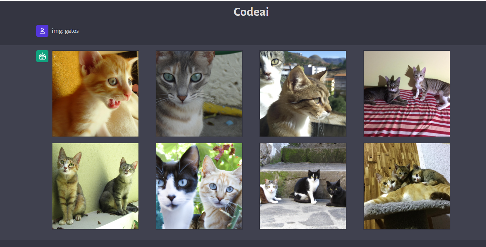

# Codeai

<!-- [Live Demo](https://codeai-mu.vercel.app) -->

## Installation

### CLIENT

-   cd client
-   npm i
-   npm run dev

### SERVER

-   cd ..
-   cd server
-   npm i
-   npm run server

## Docs

```
clear | CTRL + L = Clean page
img: = image generator
```

## Example



